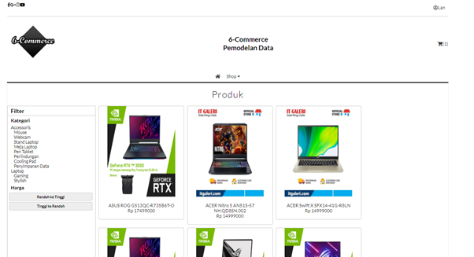
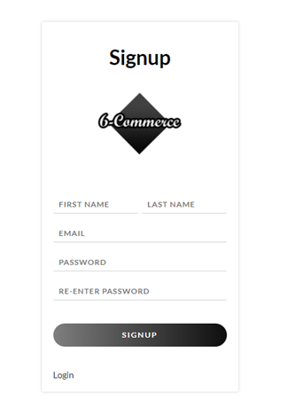
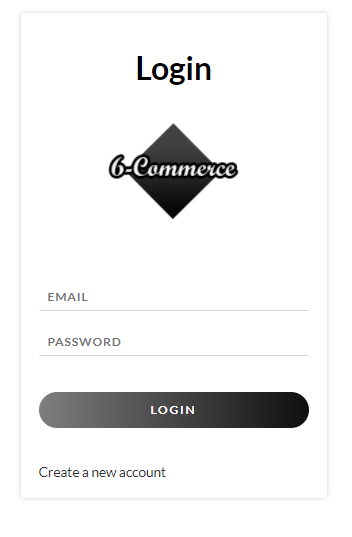
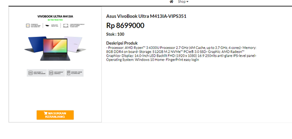
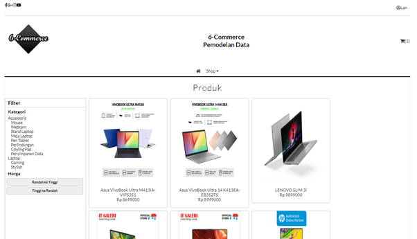
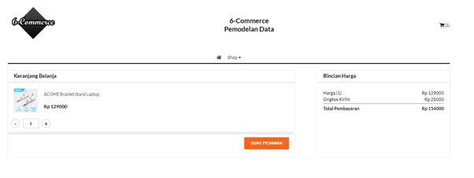
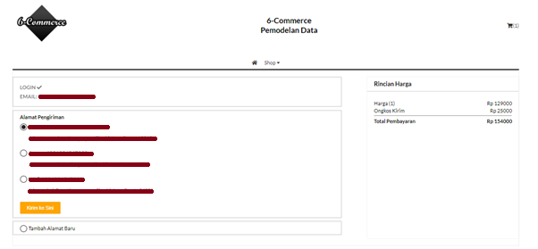
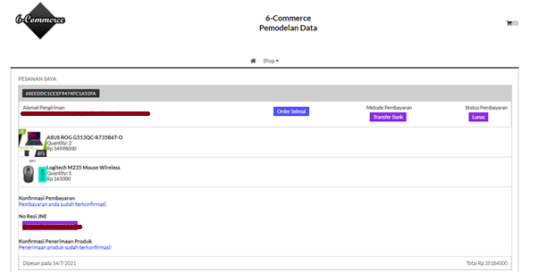

<div id="top"></div>
<!--
*** Thanks for checking out the Best-README-Template. If you have a suggestion
*** that would make this better, please fork the repo and create a pull request
*** or simply open an issue with the tag "enhancement".
*** Don't forget to give the project a star!
*** Thanks again! Now go create something AMAZING! :D
-->

<!-- PROJECT SHIELDS -->
<!--
*** I'm using markdown "reference style" links for readability.
*** Reference links are enclosed in brackets [ ] instead of parentheses ( ).
*** See the bottom of this document for the declaration of the reference variables
*** for contributors-url, forks-url, etc. This is an optional, concise syntax you may use.
*** https://www.markdownguide.org/basic-syntax/#reference-style-links
-->

<!-- PROJECT LOGO -->
<br />

<h3 align="center">Electronic Store</h3>

  <p align="center">
    Simple Restfull API Web Store with Node JS
    <br />
    <a href="https://github.com/its-lana/Electronic-Store"><strong>Explore the docs »</strong></a>
    <br />
    <br />
    <a href="https://github.com/its-lana/Electronic-Store/issues">Report Bug</a>
    ·
    <a href="https://github.com/its-lana/Electronic-Store/issues">Request Feature</a>
  </p>
</div>

<!-- TABLE OF CONTENTS -->
<details>
  <summary>Table of Contents</summary>
  <ol>
    <li>
      <a href="#about-the-project">About The Project</a>
      <ul>
        <li><a href="#built-with">Built With</a></li>
      </ul>
    </li>
    <li>
      <a href="#getting-started">Getting Started</a>
      <ul>
        <li><a href="#installation">Installation</a></li>
        <li><a href="#consume-api">How to consume API</a></li>
      </ul>
    </li>
  </ol>
</details>

<!-- ABOUT THE PROJECT width="900" height="450"-->

## About The Project

<h3 align="left">Home</h3>
<div align="center">
<a href="https://github.com/its-lana/Electronic-Store/tree/main/screenshot">
    
</a>
</div>
<h3 align="left">SignUp</h3>
<div align="center">
<a href="https://github.com/its-lana/Electronic-Store/tree/main/screenshot">
    
</a>
</div>
<h3 align="left">Login</h3>
<div align="center">
<a href="https://github.com/its-lana/Electronic-Store/tree/main/screenshot">
    
</a>
</div>
<h3 align="left">Product Details</h3>
<div align="center">
<a href="https://github.com/its-lana/Electronic-Store/tree/main/screenshot">
    
</a>
</div>
<h3 align="left">Example Filter by Stylish Category</h3>
<div align="center">
<a href="https://github.com/its-lana/Electronic-Store/tree/main/screenshot">
    
</a>
</div>
<h3 align="left">Cart Item</h3>
<div align="center">
<a href="https://github.com/its-lana/Electronic-Store/tree/main/screenshot">
    
</a>
</div>
<h3 align="left">Place Order</h3>
<div align="center">
<a href="https://github.com/its-lana/Electronic-Store/tree/main/screenshot">
    
</a>
</div>
<h3 align="left">List Order</h3>
<div align="center">
<a href="https://github.com/its-lana/Electronic-Store/tree/main/screenshot">
    
</a>
</div>

<!-- [![Product Name Screenshot][product-screenshot]](https://example.com) -->

<br />
<br />

This website was created for project at Data Modelling course. In this application, I implemented using Node JS and MongoDB for Backend and using React JS for Frontend. For caching I use Redis.
Features on this website:

-  Already using RestFull API
-  Already use caching with Redis
-  Filter by Category and Price
-  User SignUp and Login
-  Admin Features :
   1. Add and Updated Product
   2. Add and Updated Category
-  User Features :
   1. Add Product to Cart Item
   2. Add User Address (can have more than one address)
   3. Place Order
   4. See the Order List

<p align="right">(<a href="#top">back to top</a>)</p>

### Built With

-  Node JS
-  Express
-  Redis
-  MongoDB
-  React JS
-  Bcrypt
-  Json Web Token

<p align="right">(<a href="#top">back to top</a>)</p>

<!-- GETTING STARTED -->

## Getting Started

This will give instructions on setting up your project locally. To get a local copy up and running follow these simple example steps.

### Installation

1. Clone the repo
   ```sh
   https://github.com/its-lana/Electronic-Store.git
   ```
2. Create .env file in server directory and put this
   ```sh
   DB_URI
   DB_NAME
   PORT
   ```
   example :
   ```sh
   DB_URI  = mongodb://localhost:27017/
   DB_NAME = myStoreDatabase
   PORT    = 2022
   ```
3. Make sure you have redis installed and running on your machine
   <br/>
   <br/>
4. Open two terminals to the project folder, then:
   ```sh
   cd server
   npm i
   nodemon server
   ```
   ```sh
   cd client
   npm i
   npm run start
   ```

<p align="right">(<a href="#top">back to top</a>)</p>

<!-- USAGE EXAMPLES -->

### Consume API

<h3 align="left">How to Consume API</h3>
You can see the guide in the following file : <a href="https://github.com/its-lana/Electronic-Store/tree/main/server/api.txt">API.txt</a>

<p align="right">(<a href="#top">back to top</a>)</p>
